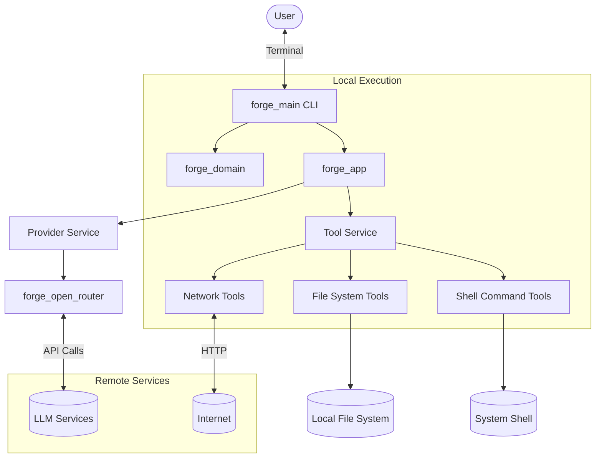

# Forge Project Analysis

## Project Overview

Forge is an intelligent CLI assistant powered by large language models (LLMs) that helps developers solve problems through natural language interactions. It offers a conversational interface that allows users to ask questions, get code explanations, perform code refactoring, and execute various development tasks without leaving their terminal.

**Core Purpose**: Forge bridges the gap between natural language understanding and development workflows, enabling developers to leverage AI assistance directly within their existing command-line environment.

**Value Proposition**:
- Increased developer productivity by reducing context switching
- Natural language interface to complex development tasks
- Integration with existing development workflows and tools
- Ability to execute commands, manipulate files, and interact with services while maintaining a conversation

**Target Users**:
- Software developers and engineers
- DevOps professionals
- System administrators
- Technical users comfortable with command-line interfaces

**Use Cases**:
- Code explanation and understanding
- Troubleshooting and debugging
- Code generation and refactoring
- System administration tasks
- Learning new technologies and frameworks

## Project Architecture

### Crate Structure

Forge follows a modular architecture organized into multiple Rust crates, each with specific responsibilities:

- **forge_main**: The main application entry point and CLI interface
- **forge_domain**: Core domain models, entities, and interfaces
- **forge_api**: API definitions and interactions for external services
- **forge_app**: Application logic and use case implementation
- **forge_open_router**: Integration with LLM providers
- **forge_display**: Terminal UI components and rendering
- **forge_fs**: File system operations and utilities
- **forge_infra**: Infrastructure services and external integrations
- **forge_stream**: Streaming data management
- **forge_tool_macros**: Procedural macros for tool definitions
- **forge_tracker**: Event tracking and analytics
- **forge_walker**: File system traversal and analysis
- **forge_ci**: Continuous integration utilities
- **forge_snaps**: Snapshot management for testing

### High-Level System Architecture



### Component Responsibilities

- **CLI Interface (forge_main)**: Handles user input, command parsing, and terminal rendering
- **Domain Layer (forge_domain)**: Defines core entities, interfaces, and business logic
- **Application Layer (forge_app)**: Orchestrates the flow between user input, LLM interaction, and tool execution
- **Provider Service**: Manages connections to LLM providers
- **Tool Service**: Registers, discovers, and executes tools based on LLM instructions
- **Infrastructure Layer**: Implements concrete services like file system operations, networking, etc.

### Data Flow

1. User enters a query or command in the terminal
2. CLI parses the input and creates a conversation context
3. Application layer sends the context to the LLM provider
4. LLM generates a response, potentially including tool execution requests
5. Tool Service executes the requested tools (file operations, shell commands, etc.)
6. Results are sent back to the LLM for further processing if needed
7. Final response is rendered to the user in the terminal

## Key Features

### Core Capabilities

- **Natural Language Understanding**: Process and understand user queries in natural language
- **Contextual Memory**: Maintain conversation context across interactions
- **Tool Execution**: Run system commands, manipulate files, and interact with services
- **Code Analysis**: Understand and explain code snippets
- **Code Generation**: Generate code based on natural language descriptions
- **System Tasks**: Perform system administration and development tasks

### Operation Modes

- **Interactive Mode**: Conversational interface for ongoing dialogue
- **Single Command Mode**: Execute a single query and return results
- **GitHub Mode**: Specialized workflow for GitHub issues and pull requests
- **File Analysis Mode**: Focused on analyzing and explaining file contents

### Supported Tools

- **File System Operations**: Create, read, update, delete files and directories
- **Shell Command Execution**: Run system commands and capture output
- **Network Operations**: Fetch data from URLs, interact with web services
- **Search**: Find patterns in files and directories
- **GitHub Integration**: Interact with GitHub issues, PRs, and repositories
- **Event Tracking**: Capture and analyze usage patterns

### Configuration Options

- **Model Selection**: Choose between different LLM providers and models
- **Response Format**: Configure how responses are formatted and displayed
- **System Context**: Customize system prompts for different assistant personas
- **API Keys**: Configure authentication for different services

## Technical Analysis

### Technologies Used

- **Rust**: Primary implementation language, providing safety, performance, and reliability
- **LLM APIs**: Integration with large language model providers
- **Terminal UI**: Command-line interface with rich text formatting
- **JSON Schema**: Used for defining tool interfaces
- **Regular Expressions**: Pattern matching for search and analysis
- **HTTP Clients**: Network communication with remote services

### Design Patterns

- **Command Pattern**: Encapsulating requests as objects for tool execution
- **Repository Pattern**: Abstracting data access for different storage mechanisms
- **Dependency Injection**: Loosely coupled components with clear interfaces
- **Adapter Pattern**: Converting between different interfaces and formats
- **Observer Pattern**: Event-based communication between components
- **Builder Pattern**: Constructing complex objects step by step

### System Operations

- **Conversation Management**: Tracking and updating conversation state
- **Tool Discovery and Execution**: Dynamic discovery and invocation of tools
- **Context Preservation**: Maintaining conversation context across interactions
- **Error Handling**: Robust error detection, reporting, and recovery
- **Streaming**: Handling streaming responses from LLM providers

### Performance Considerations

- **Concurrency**: Handling multiple tasks and operations simultaneously
- **Resource Usage**: Efficient use of memory and CPU resources
- **Response Time**: Optimizing for quick responses to user queries
- **Caching**: Storing frequent or expensive results for reuse
- **Batch Processing**: Grouping operations for efficient execution

## Getting Started

### Installation

```bash
# Install using the installation script
curl -fsSL https://raw.githubusercontent.com/antinomyhq/forge/main/install.sh | bash

# Or install from source
git clone https://github.com/antinomyhq/forge.git
cd forge
cargo install --path .
```

### Configuration

Forge can be configured using environment variables or a configuration file:

```yaml
# forge.yaml
model: gpt-4o
api_key: your_api_key_here
```

### Basic Usage

```bash
# Start an interactive session
forge

# Ask a single question
forge "How do I implement a binary search in Rust?"

# Analyze a file
forge explain path/to/file.rs

# Execute a task
forge "Create a simple HTTP server in Node.js"
```

### Common Workflows

1. **Code Explanation**:
   ```bash
   forge "Explain what this code does: $(cat complex_function.rs)"
   ```

2. **Problem Solving**:
   ```bash
   forge "I'm getting a 'cannot borrow as mutable' error in Rust. How do I fix it?"
   ```

3. **Code Generation**:
   ```bash
   forge "Write a function that calculates Fibonacci numbers using dynamic programming"
   ```

4. **System Tasks**:
   ```bash
   forge "Find all files modified in the last 7 days and create a backup"
   ```

## Development and Extension

### Contributing to Forge

1. **Set Up Development Environment**:
   ```bash
   git clone https://github.com/antinomyhq/forge.git
   cd forge
   cargo build
   ```

2. **Project Structure**:
   - `crates/` - Contains all the Rust crates that make up Forge
   - `docs/` - Documentation files
   - `templates/` - System prompt templates

3. **Testing**:
   ```bash
   cargo test
   ```

### Extending Forge with New Capabilities

To add new tools or capabilities:

1. Define the tool interface in a domain model
2. Implement the tool in the infrastructure layer
3. Register the tool with the Tool Service
4. Update system prompts to inform the LLM about the new capability

### Building Custom Versions

Forge can be customized and extended to fit specific needs:

1. **Custom Tools**: Add domain-specific tools for specialized workflows
2. **Alternative UIs**: Replace the CLI with other interfaces (GUI, web, etc.)
3. **Domain-Specific Knowledge**: Train or fine-tune LLMs with specialized data
4. **Integration with Existing Systems**: Connect Forge to enterprise systems and workflows

## Future Directions

Potential areas for expanding Forge's capabilities:

1. **Improved Context Management**: Better handling of long conversations and project contexts
2. **Local LLM Support**: Running smaller models locally for privacy and performance
3. **Multi-Modal Interactions**: Supporting images, audio, and other input/output formats
4. **Team Collaboration**: Shared contexts and collaborative problem-solving
5. **Domain-Specific Assistants**: Specialized versions for different development domains

## Conclusion

Forge represents a powerful blend of natural language processing and development tools, bringing AI assistance directly into the developer's workflow. By providing a conversational interface to development tasks within the familiar terminal environment, it reduces context switching and enables more efficient problem-solving and coding.

The modular architecture and extensible design allow for continuous evolution of capabilities, while the focus on performance and user experience ensures practical utility for daily development tasks. As LLM technology advances, Forge is well-positioned to incorporate new capabilities and provide even more sophisticated assistance to developers.