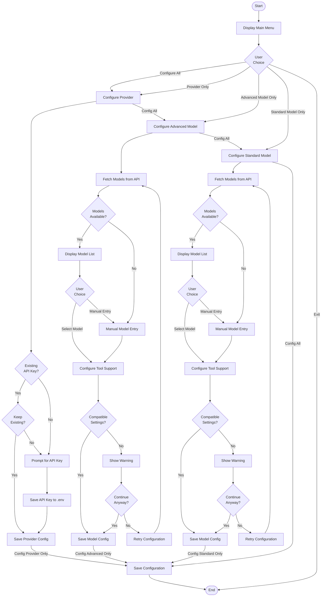

```mermaid
flowchart TB
    Start([Start]) --> MainMenu[Display Main Menu]
    MainMenu --> Choice{User\nChoice}
    
    Choice -->|Configure All| Provider[Configure Provider]
    Choice -->|Provider Only| Provider
    Choice -->|Advanced Model Only| AdvModel[Configure Advanced Model]
    Choice -->|Standard Model Only| StdModel[Configure Standard Model]
    Choice -->|Exit| End([End])
    
    Provider --> CheckKey{Existing\nAPI Key?}
    CheckKey -->|Yes| AskKeep{Keep\nExisting?}
    CheckKey -->|No| NewKey[Prompt for API Key]
    
    AskKeep -->|Yes| SaveProvider[Save Provider Config]
    AskKeep -->|No| NewKey
    NewKey --> SaveKey[Save API Key to .env]
    SaveKey --> SaveProvider
    
    Provider --> |Config All| AdvModel
    
    AdvModel --> FetchModels[Fetch Models from API]
    FetchModels --> ModelList{Models\nAvailable?}
    ModelList -->|Yes| ShowModels[Display Model List]
    ModelList -->|No| ManualEntry[Manual Model Entry]
    
    ShowModels --> ModelChoice{User\nChoice}
    ModelChoice -->|Select Model| ToolSupport[Configure Tool Support]
    ModelChoice -->|Manual Entry| ManualEntry
    
    ManualEntry --> ToolSupport
    
    ToolSupport --> Compatible{Compatible\nSettings?}
    Compatible -->|Yes| SaveModel[Save Model Config]
    Compatible -->|No| Warn[Show Warning]
    
    Warn --> Continue{Continue\nAnyway?}
    Continue -->|Yes| SaveModel
    Continue -->|No| Retry[Retry Configuration]
    Retry --> FetchModels
    
    AdvModel --> |Config All| StdModel
    
    StdModel --> FetchModels2[Fetch Models from API]
    FetchModels2 --> ModelList2{Models\nAvailable?}
    ModelList2 -->|Yes| ShowModels2[Display Model List]
    ModelList2 -->|No| ManualEntry2[Manual Model Entry]
    
    ShowModels2 --> ModelChoice2{User\nChoice}
    ModelChoice2 -->|Select Model| ToolSupport2[Configure Tool Support]
    ModelChoice2 -->|Manual Entry| ManualEntry2
    
    ManualEntry2 --> ToolSupport2
    
    ToolSupport2 --> Compatible2{Compatible\nSettings?}
    Compatible2 -->|Yes| SaveModel2[Save Model Config]
    Compatible2 -->|No| Warn2[Show Warning]
    
    Warn2 --> Continue2{Continue\nAnyway?}
    Continue2 -->|Yes| SaveModel2
    Continue2 -->|No| Retry2[Retry Configuration]
    Retry2 --> FetchModels2
    
    SaveProvider --> |Config Provider Only| FinishConfig[Save Configuration]
    SaveModel --> |Config Advanced Only| FinishConfig
    SaveModel2 --> |Config Standard Only| FinishConfig
    StdModel --> |Config All| FinishConfig
    FinishConfig --> End
```