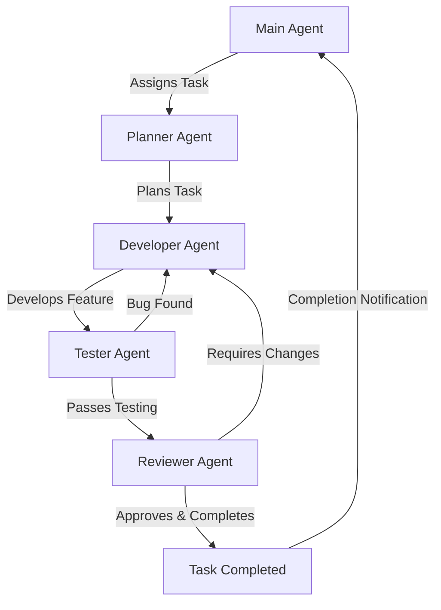

# Forge: AI-Powered Coding Assistant for Your Terminal

## Introduction
Forge is an AI-powered coding assistant that runs directly in your terminal, enhancing your development workflow with natural language commands. By seamlessly integrating with your existing development environment, Forge accelerates your coding process without requiring external servers or complex configurations.

## Core Capabilities
Forge supports multiple AI models and providers, with Claude 3.7 Sonnet as the default advanced model for complex tasks:

- Comprehensive codebase understanding and contextual assistance
- Sub-50ms startup time for seamless workflow integration
- Compatibility with standard Unix tools and existing development environments
- Project structure, file, and dependency analysis for relevant solutions
- Conversion of specifications into functional code, tests, and documentation
- Advanced programming assistance for complex coding tasks

## Getting Started

### Installation

**Mac**
```bash
brew tap antinomyhq/code-forge && brew install code-forge
```

**Linux**
```bash
curl -L https://raw.githubusercontent.com/antinomyhq/forge/main/install.sh | bash
```

### API Key Setup
1. Create a `.env` file in your home directory:
```bash
echo "OPEN_ROUTER_KEY=<your-key-here>" > ~/.env
```
_You can obtain an OpenRouter key at [Open Router](https://openrouter.ai/)_

### Basic Usage
1. Navigate to your project directory:
```bash
cd /path/to/your/project
```

2. Launch Forge:
```bash
forge
⚡ # Now just describe what you want to build or solve!
```

## Advanced Features

### Built-in Commands
Forge offers several built-in commands to enhance your interaction:
- `\new` - Start a new task when you've completed your current one
- `\info` - View environment summary, logs folder location, and command history
- `\models` - List all available AI models
- `\dump` - Save the current conversation in JSON format to a file

### WYSIWYG Shell Experience
Forge provides a rich visual experience by displaying each executed command with colorful formatting. The WYSIWYG (What You See Is What You Get) integration shows command outputs exactly as if you were typing them directly into your terminal, enhancing clarity and interaction.

### Autocomplete Functionality
Boost your productivity with intelligent command completion:
- Type `@` and press Tab for contextual file/path completion
- Use Right Arrow to complete previously executed commands
- Access command history with Up Arrow
- Quick history search with Ctrl+R
- Additional command completion features

### Security Options
Forge prioritizes security with flexible options:
- **Standard Mode** (default): Uses regular shell (bash/sh on Unix/Mac, cmd on Windows)
- **Restricted Mode**: Enable with `-r` flag to prevent potentially harmful operations

```bash
# Standard mode
forge

# Restricted secure mode
forge -r
```

Restricted mode (rbash) prevents:
- Changing directories
- Setting/modifying environment variables
- Executing commands with absolute paths
- Modifying shell options

Additional security features include:
- Direct API connection to Open Router without intermediate servers
- Local terminal operation for maximum control

## Custom Workflows and Multi-Agent Systems
For complex tasks, a single agent may not be sufficient. Forge allows you to create custom workflows with multiple specialized agents working together to accomplish sophisticated tasks.

### Creating Custom Workflows
You can configure your own workflows by creating a YAML file and pointing to it with the `-w` flag:

```bash
forge -w /path/to/your/workflow.yaml
```

### Workflow Configuration
A workflow consists of agents connected via events. Each agent has specific capabilities and can perform designated tasks.

#### Event System
Agents communicate through events which they can publish and subscribe to:

**Built-in Events**
- `user_task_init` - Published when a new task is initiated
- `user_task_update` - Published when follow-up instructions are provided by the user

#### Agent Tools
Each agent needs tools to perform tasks, configured in the `tools` field:

**Built-in Tools**
- `tool_forge_fs_read` - Read from the filesystem
- `tool_forge_fs_create` - Create or overwrite files
- `tool_forge_fs_remove` - Remove files
- `tool_forge_fs_search` - Search for patterns in files
- `tool_forge_fs_list` - List files in a directory
- `tool_forge_fs_info` - Get file metadata
- `tool_forge_process_shell` - Execute shell commands 
- `tool_forge_process_think` - Perform internal reasoning
- `tool_forge_net_fetch` - Fetch data from the internet
- `tool_forge_event_dispatch` - Dispatch events to other agents
- `tool_forge_fs_patch` - Patch existing files

#### Agent Configuration Options
- `id` - Unique identifier for the agent
- `model` - AI model to use (from the `\models` list)
- `tools` - List of tools the agent can use
- `subscribe` - Events the agent listens to
- `ephemeral` - If true, agent is destroyed after task completion
- `system_prompt` - Instructions for how the agent should behave
- `user_prompt` - Format for user inputs

#### Built-in Templates
Forge provides templates to simplify system prompt creation:
- `system-prompt-engineer.hbs`
- `system-prompt-title-generator.hbs`
- `system-prompt-advocate.hbs`
- `partial-tool-information.hbs`
- `partial-tool-examples.hbs`

Use these templates with the syntax: `{{> name-of-the-template.hbs }}`

#### Example Workflow Configuration
```yaml
variables:
  models:
    advanced_model: &advanced_model anthropic/claude-3.7-sonnet
    efficiency_model: &efficiency_model anthropic/claude-3.5-haiku

agents:
  - id: title_generation_worker
    model: *efficiency_model
    tools:
      - tool_forge_event_dispatch
    subscribe:
      - user_task_init
    system_prompt: "{{> system-prompt-title-generator.hbs }}"
    user_prompt: <technical_content>{{event.value}}</technical_content>

  - id: developer
    model: *advanced_model
    tools:
      - tool_forge_fs_read
      - tool_forge_fs_create
      - tool_forge_fs_remove
      - tool_forge_fs_patch
      - tool_forge_process_shell
      - tool_forge_net_fetch
      - tool_forge_fs_search
    subscribe:
      - user_task_init
      - user_task_update
    ephemeral: false
    system_prompt: "{{> system-prompt-engineer.hbs }}"
    user_prompt: |
      <task>{{event.value}}</task>
```

This example workflow creates two agents:
1. A title generation worker that creates meaningful titles for user conversations
2. A developer agent that can perform comprehensive file and system operations


### Building a Multi-Agent Workflow: Step-by-Step Example
Let's walk through creating a complete multi-agent workflow for software development. We'll build the configuration incrementally, agent by agent, to illustrate how each component contributes to the overall system.


#### Step 1: Define Model Variables
First, establish the AI models that will power your agents:

```yaml
variables:
  models:
    advanced_model: &advanced_model anthropic/claude-3.7-sonnet
    standard_model: &standard_model anthropic/claude-3.5-sonnet
    efficiency_model: &efficiency_model anthropic/claude-3.5-haiku
```

This configuration creates three model tiers:
- Advanced model for complex reasoning tasks
- Standard model for general-purpose tasks
- Efficiency model for simple, fast operations

#### Step 2: Configure the Main Agent
The Main Agent serves as the entry point for user tasks:

```yaml
agents:
  - id: main_agent
    model: *standard_model
    tools:
      - tool_forge_event_dispatch
    subscribe:
      - user_task_init
      - user_task_update
      - task_completed
    ephemeral: false
    system_prompt: |
      You are the Main Agent responsible for receiving the initial user task and assigning it to the Planner Agent.
      
      Your responsibilities:
      1. Understand the user's task requirements
      2. Create a clear task description
      3. Dispatch the task to the Planner Agent

      When you receive a user task, format it appropriately and dispatch it as an event called "task_for_planning".
      
      {{> partial-tool-information.hbs }}
    user_prompt: |
      <task>{{event.value}}</task>
```

The Main Agent:
- Subscribes to the `user_task_init` and `user_task_update` event to receive tasks
- Also subscribes to the `task_completed` event to receive completion notifications
- Uses only the event dispatch tool since it doesn't need to manipulate files
- Creates a bridging function between the user and the planning process

#### Step 3: Add the Planner Agent
Next, configure the Planner Agent to analyze requirements and create development plans:

```yaml
  - id: planner_agent
    model: *advanced_model
    tools:
      - tool_forge_fs_read
      - tool_forge_fs_search
      - tool_forge_event_dispatch
    subscribe:
      - task_for_planning
    ephemeral: false
    system_prompt: |
      You are the Planner Agent responsible for analyzing tasks and creating detailed development plans.
      
      Your responsibilities:
      1. Analyze the task requirements
      2. Understand the existing codebase when necessary
      3. Break down the task into manageable steps
      4. Create a structured development plan
      5. Dispatch the plan to the Developer Agent
      
      When you receive a task, examine the project structure if needed, create a detailed plan, and dispatch it as an event called "plan_for_development".
      
      {{> partial-tool-information.hbs }}
      {{> partial-tool-examples.hbs }}
    user_prompt: |
      <planning_task>{{event.value}}</planning_task>
```

The Planner Agent:
- Uses the advanced model for sophisticated analysis
- Has file reading and search capabilities to understand the codebase
- Creates structured development plans based on user requirements

#### Step 4: Implement the Developer Agent
The Developer Agent translates plans into actual code:

```yaml
  - id: developer_agent
    model: *advanced_model
    tools:
      - tool_forge_fs_read
      - tool_forge_fs_create
      - tool_forge_fs_remove
      - tool_forge_fs_patch
      - tool_forge_process_shell
      - tool_forge_net_fetch
      - tool_forge_fs_search
      - tool_forge_event_dispatch
    subscribe:
      - plan_for_development
      - changes_required
    ephemeral: false
    system_prompt: |
      You are the Developer Agent responsible for implementing features based on the provided plan.
      
      Your responsibilities:
      1. Understand the development plan
      2. Implement the required code and features
      3. Follow best coding practices and standards
      4. Document your code appropriately
      5. Submit the implemented feature for testing
      
      When you complete the implementation, dispatch it as an event called "feature_for_testing".
      If you receive change requests, implement them and resubmit for testing.
      
      {{> partial-tool-information.hbs }}
      {{> partial-tool-examples.hbs }}
    user_prompt: |
      <development_plan>{{event.value}}</development_plan>
```

The Developer Agent:
- Uses the advanced model for sophisticated implementation
- Has access to the full range of file and system tools
- Can both create new code and modify existing code
- Responds to both initial plans and change requests

#### Step 5: Configure the Tester Agent
The Tester Agent verifies the functionality and quality of implemented features:

```yaml
  - id: tester_agent
    model: *standard_model
    tools:
      - tool_forge_fs_read
      - tool_forge_process_shell
      - tool_forge_fs_search
      - tool_forge_event_dispatch
    subscribe:
      - feature_for_testing
    ephemeral: false
    system_prompt: |
      You are the Tester Agent responsible for verifying the functionality and quality of implemented features.
      
      Your responsibilities:
      1. Review the implemented code
      2. Run tests to verify functionality
      3. Check for edge cases and potential bugs
      4. Validate that the implementation meets requirements
      5. Provide detailed feedback on any issues found
      
      If you find bugs or issues, dispatch them as an event called "bugs_found" to the Developer Agent.
      If the feature passes testing, dispatch it as an event called "feature_for_review" to the Reviewer Agent.
      
      {{> partial-tool-information.hbs }}
      {{> partial-tool-examples.hbs }}
    user_prompt: |
      <feature_to_test>{{event.value}}</feature_to_test>
```

The Tester Agent:
- Uses shell tools to run tests and verify functionality
- Can dispatch issues back to the Developer Agent
- Forwards successful implementations to the Reviewer Agent

#### Step 6: Establish the Reviewer Agent
The Reviewer Agent performs the final quality assessment:

```yaml
  - id: reviewer_agent
    model: *advanced_model
    tools:
      - tool_forge_fs_read
      - tool_forge_fs_search
      - tool_forge_event_dispatch
    subscribe:
      - feature_for_review
    ephemeral: false
    system_prompt: |
      You are the Reviewer Agent responsible for the final quality assessment of implemented features.
      
      Your responsibilities:
      1. Review the code for quality, readability, and maintainability
      2. Ensure the code follows project standards and best practices
      3. Verify that the implementation satisfies the original requirements
      4. Provide constructive feedback for improvements
      5. Make the final decision on feature approval
      
      If changes are required, dispatch them as an event called "changes_required" to the Developer Agent.
      If the feature is approved, dispatch it as an event called "task_completed" to mark completion.
      
      {{> partial-tool-information.hbs }}
      {{> partial-tool-examples.hbs }}
    user_prompt: |
      <feature_to_review>{{event.value}}</feature_to_review>
```

The Reviewer Agent:
- Uses the advanced model for comprehensive code review
- Can request changes from the Developer Agent if needed
- Marks tasks as completed when they meet quality standards

The flexibility of Forge's workflow system allows you to create specialized multi-agent teams tailored to your specific development needs.

## ❤️ Support Code Forge

Your support drives Code-Forge's continued evolution! By starring our GitHub repository, you:

- Help others discover this powerful tool
- Motivate our development team
- Enable us to prioritize new features
- Strengthen our open-source community

Recent community feedback has helped us implement features like improved autocomplete, cross-platform optimization, and enhanced security features. Join our growing community of developers who are reshaping the future of AI-powered development!
